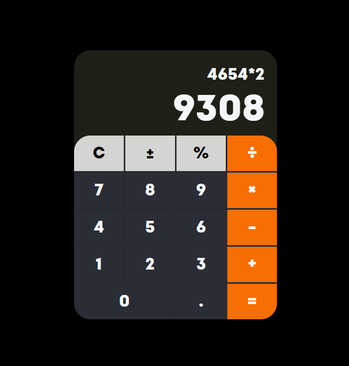

# CALCULATOR

- Perform operations like + - \* /
- clear button
- horizontal scroll bar for large numbers
- allows decimal numbers
- decimal not allowed after pressing operator

Live - https://overdrivemachines.github.io/calculator/

## References

- Fonts
  - https://www.retrosupply.co/blogs/retrosupply-blog/best-free-retro-and-vintage-fonts
  - https://www.fontfabric.com/fonts/intro/
- Font CSS - https://css-tricks.com/snippets/css/using-font-face-in-css/
- Theme - https://www.behance.net/gallery/150095997/Calculator-design-%28retro-pixel-style%29?tracking_source=search_projects%7Ccalculator
